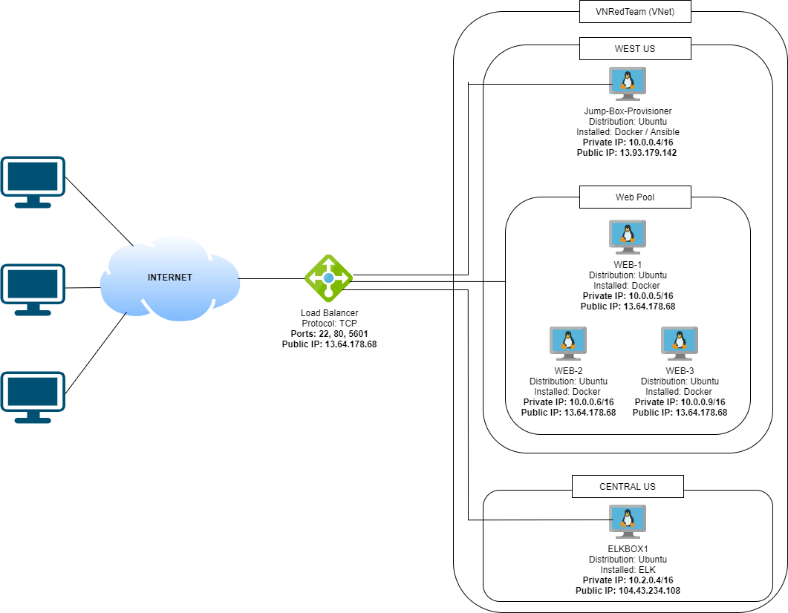
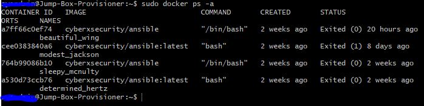

## Automated ELK Stack Deployment

The files in this repository were used to configure the network depicted below. 

These files have been tested and used to generate a live ELK deployment on Azure. They can be used to either recreate the entire deployment pictured above. Alternatively, select portions of the yaml playbook file may be used to install only certain pieces of it, such as Filebeat.

 #### filebeat-playbook.txt

This document contains the following details:
- Description of the Topology
- Access Policies
- ELK Configuration
  - Beats in Use
  - Machines Being Monitored
- How to Use the Ansible Build

### Description of the Topology

The main purpose of this network is to expose a load-balanced and monitored instance of DVWA, the D*mn Vulnerable Web Application.

Load balancing ensures that the application will be highly available, in addition to restricting access to the network.
#### Load balancers can prove vital to security as it can be used to offload attack traffic to another server. Jump box allows centraliaze management of other servers. 

Integrating an ELK server allows users to easily monitor the vulnerable VMs for changes to the data and system logs.
#### Filebeat is a lightweight shipper for forwarding and centralizing log data.
#### Metricbeat is a lightweight shipper that you can install on your servers to periodically collect metrics from the operating system and from services running on the server.

The configuration details of each machine may be found below.

| Name     | Function | IP Address | Operating System |
|----------|----------|------------|------------------|
| Jump Box | Mgmt     | 10.0.0.4   | Linux            |
| Web-1    | Web Srv  | 10.0.0.5   | Linux            |
| Web-2    | Web Srv  | 10.0.0.6   | Linux            |
| Web-3    | Web Srv  | 10.0.0.9   | Linux            |
| ELKBOX1  | Monitor  | 10.2.0.4   | Linux            |

### Access Policies

The machines on the internal network are not exposed to the public Internet. 

Only the Jump Box machine can accept connections from the Internet. Access to this machine is only allowed from the following IP addresses:
#### 172.100.119.55

Machines within the network can only be accessed by SSH.
#### Jump box (10.0.0.4) was allowed ssh access to the ELKBOX1

A summary of the access policies in place can be found in the table below.

| Name     | Publicly Accessible | Allowed IP Addresses |
|----------|---------------------|----------------------|
| Jump Box | Yes                 | 172.100.119.55       |
|          |                     |                      |
|          |                     |                      |

### Elk Configuration

Ansible was used to automate configuration of the ELK machine. No configuration was performed manually, which is advantageous because...
#### It's free and can be used for cloud provisioning, configuration management, application deployment, intra-service orchestration, and many other IT needs.

The playbook implements the following tasks:
#### Downloads and installs filebeat install file
#### Inserts the relevant yaml files
#### starts and sets up filebeat service

The following screenshot displays the result of running `docker ps` after successfully configuring the ELK instance.

**Note**: The following image link needs to be updated. Replace `docker_ps_output.png` with the name of your screenshot image file.  

### Target Machines & Beats
This ELK server is configured to monitor the following machines:
#### 10.0.0.5
#### 10.0.0.6
#### 10.0.0.9

We have installed the following Beats on these machines:
#### 10.0.0.5
#### 10.0.0.6
#### 10.0.0.9

These Beats allow us to collect the following information from each machine:
 #### Metricbeat takes the metrics and statistics that it collects and ships them to the output that you specify, such as Elasticsearch or Logstash.

### Using the Playbook
In order to use the playbook, you will need to have an Ansible control node already configured. Assuming you have such a control node provisioned: 

SSH into the control node and follow the steps below:
- Copy the filebeat-playbook file to /etc/ansible.
- Update the filebeat-config file to include the username and password for the admin user.
- Run the playbook, and navigate to one of the web servers to check that the installation worked as expected.

